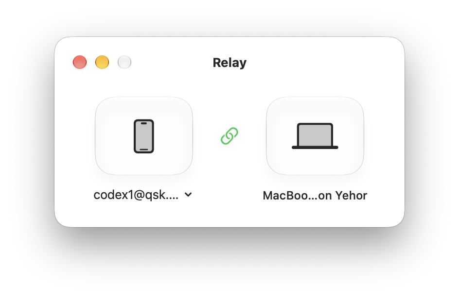

<p align="center">
  
</p>

<h1 align="center">Relay</h1>

<picture>
  <source media="(prefers-color-scheme: dark)" srcset="screenshots/relay-dark.png">
  <source media="(prefers-color-scheme: light)" srcset="screenshots/relay-light.png">
  
</picture>

Native macOS bridge for ChatGPT Remote across separate phone and Mac accounts.

## Features

- Browser sign-in, account imports, and QR pairing
- Access Mac chats from the native ChatGPT Remote tab on your phone

## Build

```bash
./Scripts/build_dmg.sh
```

The app and DMG are created in `dist/`.
